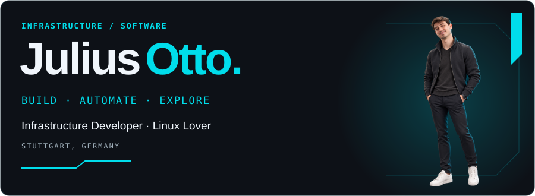
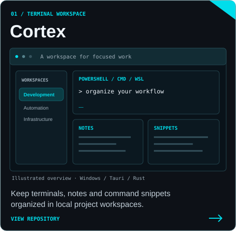
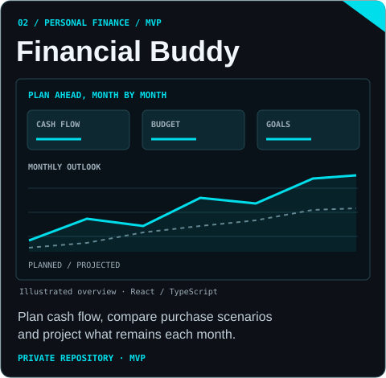
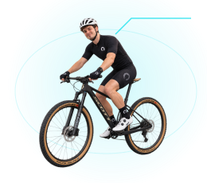

<a href="https://juliusotto.vercel.app/"><picture><source media="(max-width: 600px)" srcset="./profile-hero-mobile.svg" /></picture></a>

I work where **infrastructure and software meet** — building practical tools,
automating repetitive work and making systems easier to operate.

📍 Stuttgart, Germany &nbsp; · &nbsp; 🌐 [Portfolio](https://juliusotto.vercel.app/)

<h2><picture><source media="(max-width: 600px)" srcset="./profile-heading-toolkit-mobile.svg" /></picture></h2>

> Every tool started as something I didn't know yet.

<h3></h3>

  
  
   
  
  

<h3></h3>

  
   
  
  

<h3></h3>

  
  
   
  
  

 

<h2><picture><source media="(max-width: 600px)" srcset="./profile-heading-projects-mobile.svg" /></picture></h2>

Practical projects, built around real things people need.

  
  

<h2><picture><source media="(max-width: 600px)" srcset="./profile-heading-background-mobile.svg" /></picture></h2>

I have a degree in IT with strong foundations in:

Software Development · Software Architecture  
Cloud Computing · AI · Data Modeling

What shaped me most, though, was always the practical side:
**building, experimenting and solving real problems**.

 

<h2><picture><source media="(max-width: 600px)" srcset="./profile-heading-life-mobile.svg" /></picture></h2>

When I'm away from code and infrastructure, I'm usually somewhere around:

🚴 **Cycling**  
🏔️ **Mountains & outdoors**  
✈️ **Travel**  
☕ **Good coffee**

 
