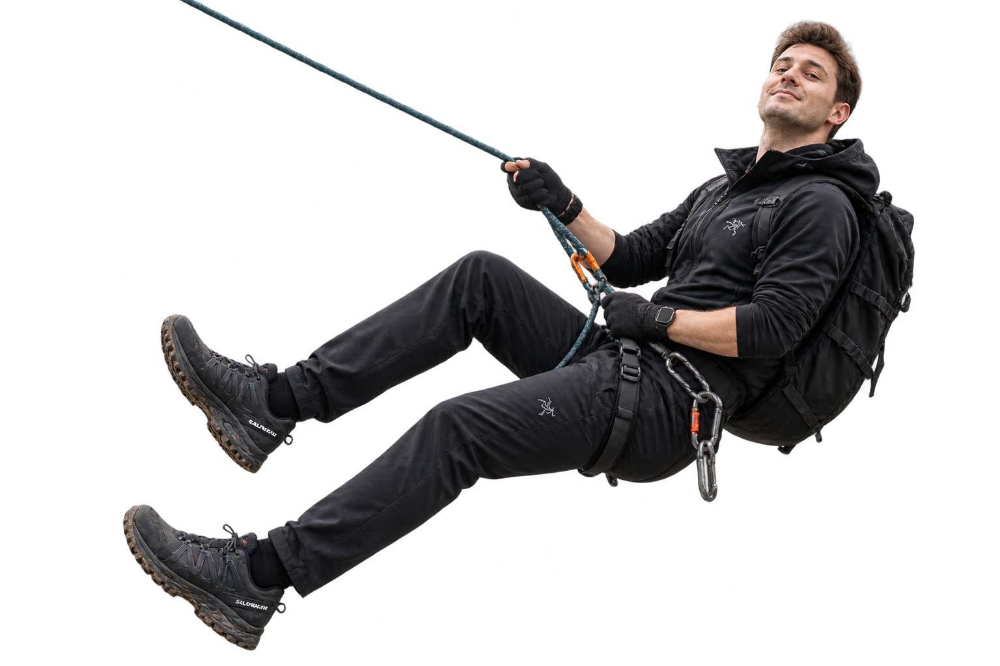

 
 
  
  
 
 Julius Otto

 

### Infrastructure Developer · Linux Lover

I work where **infrastructure and software meet** — building practical tools,
automating repetitive work and making systems easier to operate.

📍 Stuttgart, Germany &nbsp; · &nbsp;
🌐 <a href="https://juliusotto.vercel.app/">juliusotto.dev</a>

 

---

## 🧗 What I'm climbing

> Every tool started as something I didn't know yet.

### Infrastructure

### Automation

### Engineering

 

--- 
## 🎓 Background

I have a degree in IT with strong foundations in:

`Software Development` · `Software Architecture` · `Cloud Computing` · `AI` · `Data Modeling`

What shaped me most, though, was always the practical side:

**building, experimenting and solving real problems**.

 

---

## 🚲 Outside of tech

When I'm away from code and infrastructure, I'm usually somewhere around:

🚴 **Cycling**  
🏔️ **Mountains & outdoors**  
✈️ **Travel**  
☕ **Good coffee**

 
